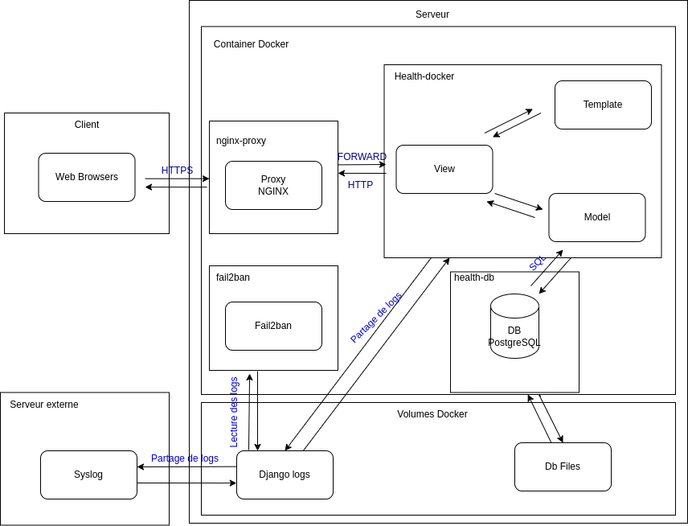

# By Ensay Mery, André Alexis, Delannoy Alexis, Michaux Clément, Castreuil Mateo and Bettigneis Edouard

# SSD - HEALTH


## Prerequisites
If you do not have a DNS entry for the project, modify your /etc/hosts file and add the corresponding entry.


### Configure docker-compose environment variables
Copy sample environment file to environment file:
```bash
$ cp env.sample .env
```

Configure your environment variable:
```bash
$ vim .env
```
```text
###############
# DATABASE ENV
###############

# Configure your POSTGRES user
POSTGRES_USER=user

# You can keep this value
POSTGRES_DB=health

# Configure your POSTGRES password
POSTGRES_PASSWORD=secret


###############
# WEB ENV
###############

# Configure your web host (example: health.labo). It must be the same as your DNS entry in your /etc/hosts file.
WEB_HOST=host.tld
```

### Generate self-signed certificate
Generate private key:
```bash
$ openssl genrsa -out nginx-rproxy/certs/<WEB_HOST>.key 4096 # Example: health.labo.key
```

Generate self-signed certificate with your private key:
```bash
$ openssl req -x509 -new -nodes -key nginx-rproxy/certs/<WEB_HOST>.key -sha256 -days 10000 -out nginx-rproxy/certs/<WEB_HOST>.crt # Example: nginx-rproxy/certs/health.labo.crt
```

The certificate and private key must respect a nomenclature, otherwise it won't work. You can check nginx-rproxy/certs/readme.txt for more informations

## Run the project
```bash
$ docker-compose up -d
```

## Visite website

To visite the website, you can go on this url:
```
https://<WEB_HOST>
```

## Base configuration

To test our application, we advice you to create in https://<WEB_HOST>/register :
- One patient
- One Doctor
- One Admin

Doctor needs to be enable by an administrator.
And an administrator need to be a normal user like patient but promoted with the command in the next section.

After these accounts were created, you can create file, agreements, ... and enjoy !

## Promote a user to administrator 
```bash
docker exec -it health-django python manage.py runscript set_user_to_admin --script-args <email>
```

## Syslog configuration

You can enable syslog via the docker-compose.yml file. Uncomment the following lines 
```yaml
    logging:
      driver: syslog
      options:
        syslog-tls-skip-verify: "true" # Remove this line if you have a valid certificate
        syslog-address: "tcp+tls://remote-log.xn--andr-epa.be" # Replace with your own domain
        syslog-format: "rfc3164"
        tag: "health-django"
```

## Fail2Ban 
If a remote client enters the wrong password three times in the same hour, it is banned for 24 hours. You can change these values in the file data/jail.d/django-auth.local.
Firstly, you need to install iptables :
```bash
sudo apt install iptables
```

### Unban IP
```bash
fail2ban-client set django-auth unbanip <IP_ADDRESS>
```

### Ban IP
```bash
fail2ban-client set django-auth banip <IP_ADDRESS>
```

### View banned IP
```bash
fail2ban-client status django-auth
```

